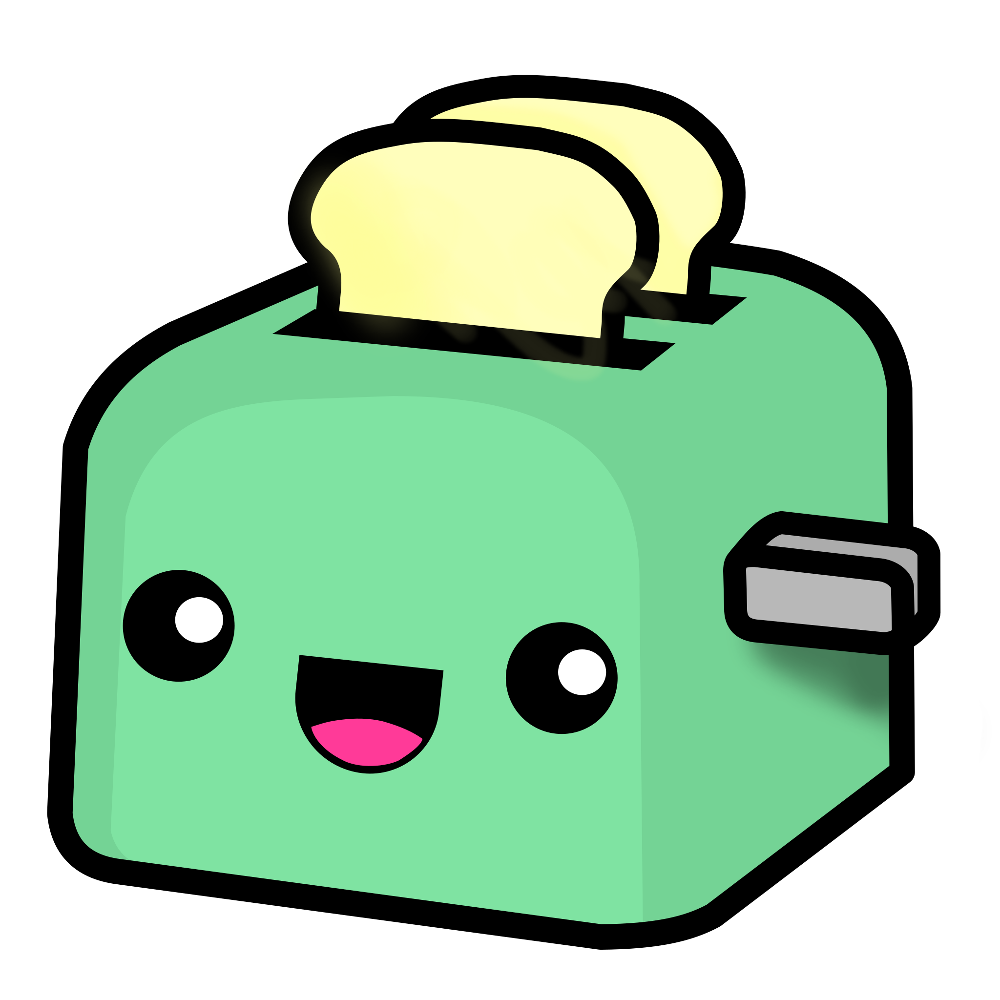
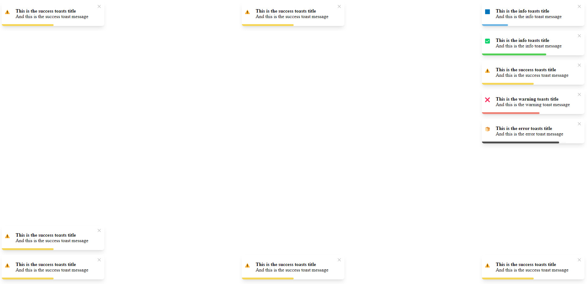
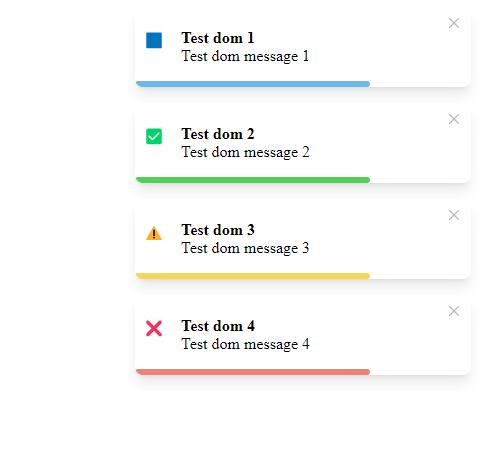

<div style="display: flex; justify-content: center" >
    
</div>
<div style="display: flex; justify-content: center" >

# Toastinette.js

</div>

## (under develpoment. No backward compatibility until stable version)

Toastinette.js is a JS package that allows you to add notifications to your app.

<hr/>

[](https://img.shields.io/bundlephobia/minzip/toastinette.js?style=for-the-badge)
[](https://img.shields.io/npm/l/toastinette.js?style=for-the-badge)
[](https://img.shields.io/npm/v/toastinette.js?style=for-the-badge)
[](https://www.jsdelivr.com/package/npm/toastinette.js)

[//]: # "Add badges from somewhere like: [shields.io](https://shields.io/)"
[//]: # "## Demo"

## Installation

yarn :

```bash
yarn add toastinette.js
```

npm :

```bash
npm i toastinette.js
```

## Documentation

[//]: # "[Documentation](https://www.google.com/)"

improved documentation will be available when this package reaches a stable release

### Import js and style from toastinette.js

```js
import 'toastinette.js/dist/style.css'
import { Toaster } from "toastinette.js";
```

### Instantiate the toaster

```js
let toaster = new Toaster();
```

## Usage through javascript

### Create toasts using Javascript

```js
toaster.info(title, text, position, time);
```

| Option     |   type   |                    Default                    |                                                                 Description                                                                 |
| ---------- | :------: | :-------------------------------------------: | :-----------------------------------------------------------------------------------------------------------------------------------------: |
| `title`    | `string` |   `This is the ${toast type} toasts title`    |                                                             Title of the toast                                                              |
| `text`     | `string` | `And this is the ${toast type} toast message` |                                                              Text of the toast                                                              |
| `position` | `string` |                  `top-right`                  | Position of the toast <br/> it can be `top-right` or `top-center` or `top-left` or <br/> `bottom-right` or `bottom-center` or `bottom-left` |
| `time`     | `number` |                    `5000`                     |                                                           Display duration in ms                                                            |

```js
toaster.info(
  "This is the info toasts title",
  "And this is the info toast message",
  "top-right",
  10000
);
toaster.success(
  "This is the info toasts title",
  "And this is the info toast message",
  "top-right",
  20000
);
toaster.warning(
  "This is the success toasts title",
  "And this is the success toast message",
  "top-right",
  15000
);
toaster.warning(
  "This is the success toasts title",
  "And this is the success toast message",
  "bottom-right",
  15000
);
toaster.warning(
  "This is the success toasts title",
  "And this is the success toast message",
  "top-left",
  15000
);
toaster.warning(
  "This is the success toasts title",
  "And this is the success toast message",
  "bottom-left",
  15000
);
toaster.warning(
  "This is the success toasts title",
  "And this is the success toast message",
  "bottom-left",
  15000
);
toaster.warning(
  "This is the success toasts title",
  "And this is the success toast message",
  "top-center",
  15000
);
toaster.warning(
  "This is the success toasts title",
  "And this is the success toast message",
  "bottom-center",
  15000
);
toaster.error(
  "This is the warning toasts title",
  "And this is the warning toast message",
  "top-right",
  17000
);
toaster.default(
  "This is the error toasts title",
  "And this is the error toast message",
  "top-right",
  30000
);
```

Result :

<div style="display: flex; justify-content: center" >
    
</div>

## Usage through SSR

```html
<div data-toastinette-dom-toast>
  <div
    data-toastinette-toast
    data-toastinette-type="info"
    data-toastinette-title="Test dom 1"
    data-toastinette-message="Test dom message 1"
  ></div>
  <div
    data-toastinette-toast
    data-toastinette-type="success"
    data-toastinette-title="Test dom 2"
    data-toastinette-message="Test dom message 2"
  ></div>
  <div
    data-toastinette-toast
    data-toastinette-type="warning"
    data-toastinette-title="Test dom 3"
    data-toastinette-message="Test dom message 3"
  ></div>
  <div
    data-toastinette-toast
    data-toastinette-type="error"
    data-toastinette-title="Test dom 4"
    data-toastinette-message="Test dom message 4"
  ></div>
</div>
```

Result :

<div style="display: flex; justify-content: center" >
    
</div>

## License

[](https://img.shields.io/npm/l/toastinette.js?style=for-the-badge)


This package is heavily inspired by [React-Toastify](https://github.com/fkhadra/react-toastify). Go leave a star on it :)
